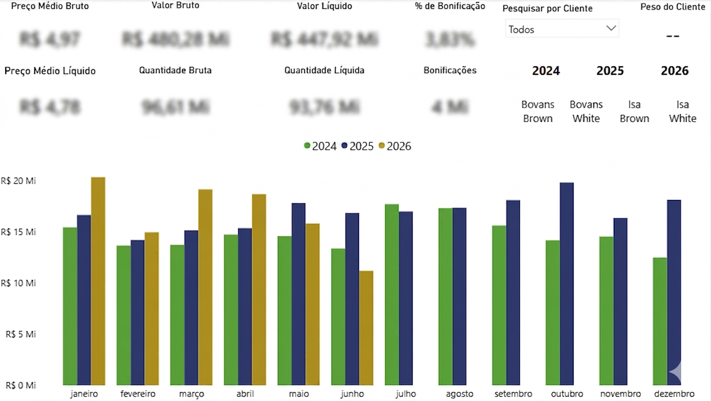

# Agrosys ETL → Power BI

Python pipeline that extracts sales data from the Agrosys ERP via ODBC, consolidates 5 Data Warehouse tables, and exports a clean dataset to feed a Power BI dashboard.

## Problem

Manually updating sales data (extracting and organizing it in Excel) used to take about **2 hour**.

## Solution

A notebook that:
1. Connects directly to the ERP's Data Warehouse via ODBC
2. Extracts the invoice items, invoice header, product registry, customer, and city tables
3. Selects only the relevant columns
4. Consolidates everything through merges (equivalent to Excel's VLOOKUP/XLOOKUP)
5. Creates year and month columns for easier time-based analysis
6. Exports the final result to Excel, ready to be consumed by Power BI

## Result

Update time reduced from **1 hour to less than 5 minutes**.

## Tech stack

- Python
- pandas
- pyodbc
- Power BI

## Dashboard Preview

